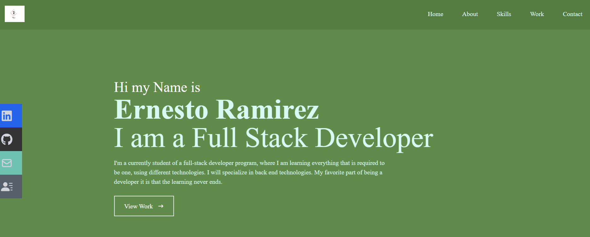
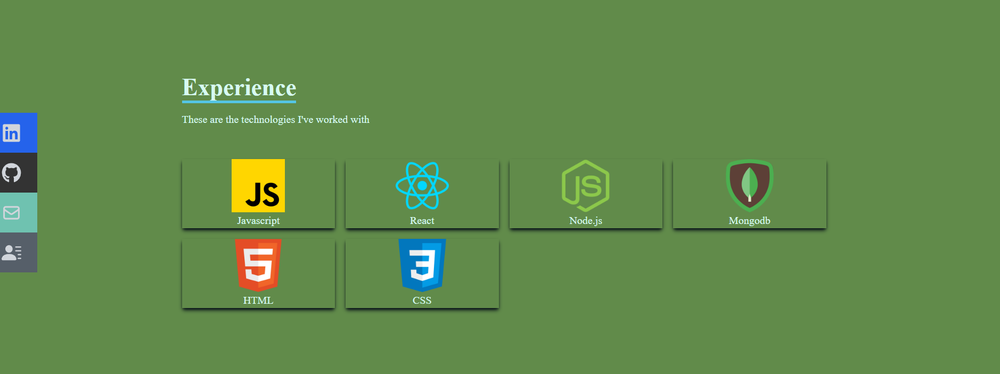

# <React Portfolio>

## Description

This is a professional portfolio made with REACT. This is a job seeking element where I implemented different technologies where I was able to find them useful and added to my library of technologies I can work with. This portfolio contains information about the projects I have worked in the past and it is very friendly for you to use.

## Table of Contents

- [Credits](#credits)
- [License](#license)

  
  

## Credits

I was able to find different ways for me to create a Portfolio
This video inspired m,e to create mine,
https://www.youtube.com/watch?v=2kg0z1qNrkw

## License

MIT

#
